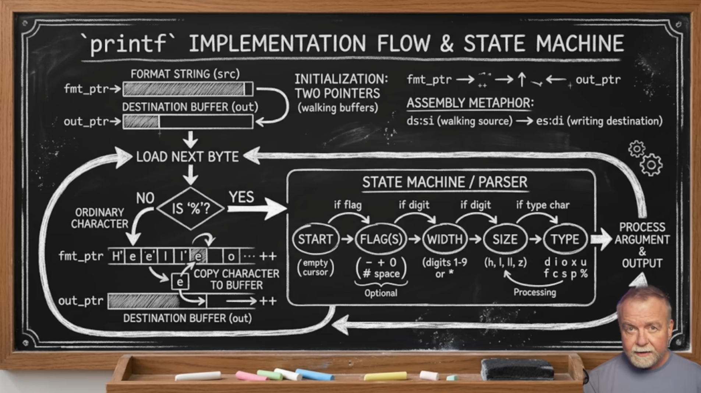

# The Complete Breakdown of `printf()` in C

- [The Complete Breakdown of `printf()` in C](#the-complete-breakdown-of-printf-in-c)
  - [What is `printf()`?](#what-is-printf)
  - [The Format Specifier Anatomy](#the-format-specifier-anatomy)
  - [The Specifier -- What Type to Print](#the-specifier----what-type-to-print)
  - [Flags -- Controlling Alignment and Padding](#flags----controlling-alignment-and-padding)
  - [Width -- Controlling Minimum Field Width](#width----controlling-minimum-field-width)
  - [Precision -- Controlling Decimal Places and String Length](#precision----controlling-decimal-places-and-string-length)
  - [Length Modifiers -- Specifying Exact Data Sizes](#length-modifiers----specifying-exact-data-sizes)
  - [Escape Sequences Inside the Format String](#escape-sequences-inside-the-format-string)
  - [Multiple Arguments](#multiple-arguments)
  - [The Return Value of `printf()`](#the-return-value-of-printf)
  - [Common Beginner Mistakes](#common-beginner-mistakes)
  - [Basic Quick Reference Summary](#basic-quick-reference-summary)
- [`printf()` Implementation Flow \& State Machine](#printf-implementation-flow--state-machine)
  - [How `printf()` Actually Works Under the Hood](#how-printf-actually-works-under-the-hood)
  - [Initialization -- Two Walking Pointers](#initialization----two-walking-pointers)
  - [The Main Loop -- Load Next Byte](#the-main-loop----load-next-byte)
  - [Path 1 -- Ordinary Character (NO)](#path-1----ordinary-character-no)
  - [Path 2 -- Format Specifier Detected (YES)](#path-2----format-specifier-detected-yes)
  - [The State Machine / Parser](#the-state-machine--parser)
    - [Stage 1 -- START](#stage-1----start)
    - [Stage 2 -- FLAG(S) (Optional)](#stage-2----flags-optional)
    - [Stage 3 -- WIDTH (Optional)](#stage-3----width-optional)
    - [Stage 4 -- SIZE (Processing)](#stage-4----size-processing)
    - [Stage 5 -- TYPE (Required)](#stage-5----type-required)
  - [Process Argument \& Output](#process-argument--output)
  - [The Full Flow Summarized](#the-full-flow-summarized)
  - [Why This Matters to You as a C Programmer](#why-this-matters-to-you-as-a-c-programmer)
  - [Implementation Flow \& State Machine Quick Reference Summary](#implementation-flow--state-machine-quick-reference-summary)
  - [Security Vulnerabilities With `printf()`](#security-vulnerabilities-with-printf)
  - [Why `printf()` Can Be Dangerous](#why-printf-can-be-dangerous)
  - [Format String Attack -- The Most Critical Vulnerability](#format-string-attack----the-most-critical-vulnerability)
    - [What is a Format String Attack](#what-is-a-format-string-attack)
    - [The Vulnerable Pattern](#the-vulnerable-pattern)
    - [What an Attacker Can Do With It](#what-an-attacker-can-do-with-it)
    - [The Fix](#the-fix)
  - [Buffer Overflow With `sprintf()`](#buffer-overflow-with-sprintf)
    - [What is a Buffer Overflow](#what-is-a-buffer-overflow)
    - [The Fix](#the-fix-1)
  - [`%n` -- The Write Primitive](#n----the-write-primitive)
    - [What is the Write Primitive](#what-is-the-write-primitive)
    - [The Fix](#the-fix-2)
  - [Integer Overflow With Width and Precision](#integer-overflow-with-width-and-precision)
    - [What Is Integer Overflow](#what-is-integer-overflow)
    - [The Fix](#the-fix-3)
  - [Compiler Warnings and Defenses](#compiler-warnings-and-defenses)
  - [Vulnerable vs Safe Patterns](#vulnerable-vs-safe-patterns)
  - [Printf Security Vulnerabilities Quick Reference Summary](#printf-security-vulnerabilities-quick-reference-summary)
  - [Practical Examples of `printf()` for Output, Logs, and Debugging in C](#practical-examples-of-printf-for-output-logs-and-debugging-in-c)
  - [Formatted User-Facing Output](#formatted-user-facing-output)
    - [Receipts and Invoices](#receipts-and-invoices)
    - [Progress Indicators](#progress-indicators)
    - [Displaying a Table of Data](#displaying-a-table-of-data)
  - [Logging](#logging)
    - [Basic Log Levels](#basic-log-levels)
    - [Logging to a File](#logging-to-a-file)
    - [Logging to `stderr`](#logging-to-stderr)
  - [Debugging](#debugging)
    - [Printing Variable State](#printing-variable-state)
    - [The `__FILE__`, `__LINE__`, and `__func__` Macros](#the-__file__-__line__-and-__func__-macros)
    - [Building a Reusable Debug Macro](#building-a-reusable-debug-macro)
    - [Printing Memory in Hex (Memory Dump)](#printing-memory-in-hex-memory-dump)
    - [Watching a Variable Change Over a Loop](#watching-a-variable-change-over-a-loop)
  - [Practical Example Quick Reference Summary](#practical-example-quick-reference-summary)

## What is `printf()`?

`printf()` stands for **print formatted**. It is a function from `<stdio.h>` that writes formatted output to the screen. The power of `printf()` is not just printing plain text -- it lets you embed variable values, control number formatting, align text, and build complex output strings all in one function call.

**Syntax:**
```c
printf("format string", argument1, argument2, ...);
```

The format string is what gets printed. Anywhere you place a format specifier inside it, `printf()` swaps in the corresponding argument from the list that follows.

## The Format Specifier Anatomy

Every format specifier follows this structure:

```
%[flags][width][.precision][length]specifier
```

Only the `%` and the final specifier are required. Everything in between is optional and controls how the value is displayed.

```c
printf("%10.2f", 3.14159);  // width 10, 2 decimal places
```

## The Specifier -- What Type to Print

The specifier at the end tells `printf()` what data type it is printing:

| Specifier | Type | Output Example |
|-----------|------|----------------|
| `%d` or `%i` | `int` | `42` |
| `%f` | `float` or `double` | `3.140000` |
| `%lf` | `double` (explicit) | `3.140000` |
| `%e` | Scientific notation | `3.140000e+00` |
| `%E` | Scientific notation uppercase | `3.140000E+00` |
| `%g` | Shorter of `%f` or `%e` | `3.14` |
| `%c` | `char` | `A` |
| `%s` | String (`char` array) | `Hello` |
| `%p` | Pointer address | `0x7ffee4b` |
| `%x` | Hexadecimal (lowercase) | `2a` |
| `%X` | Hexadecimal (uppercase) | `2A` |
| `%o` | Octal | `52` |
| `%u` | Unsigned integer | `42` |
| `%zu` | `size_t` | `8` |
| `%%` | Literal percent sign | `%` |

```c
int n = 42;
printf("%d\n",  n);   // Output: 42
printf("%x\n",  n);   // Output: 2a
printf("%o\n",  n);   // Output: 52
printf("%e\n",  3.14);  // Output: 3.140000e+00
printf("%%\n");         // Output: %
```

## Flags -- Controlling Alignment and Padding

Flags come right after the `%` and change the appearance of the output:

| Flag | Meaning |
|------|---------|
| `-` | Left-align the output within the given width |
| `+` | Always show the sign (`+` or `-`) for numbers |
| `0` | Pad with zeros instead of spaces |
| ` ` (space) | Insert a space before positive numbers |
| `#` | Alternate form (`0x` prefix for hex, `0` for octal) |

```c
printf("%d\n",   42);    // Output:  42
printf("%+d\n",  42);    // Output: +42
printf("%+d\n", -42);    // Output: -42
printf("% d\n",  42);    // Output:  42  (space before positive)
printf("%#x\n",  42);    // Output: 0x2a
printf("%#o\n",  42);    // Output: 052
```

## Width -- Controlling Minimum Field Width

Width sets the **minimum number of characters** to use when printing. If the value is shorter than the width, it gets padded with spaces (or zeros if the `0` flag is used). If the value is longer, the width is ignored and the full value prints.

```c
printf("%10d\n",  42);   // Output:         42  (right-aligned, padded with spaces)
printf("%-10d|\n", 42);  // Output: 42        |  (left-aligned)
printf("%010d\n",  42);  // Output: 0000000042  (padded with zeros)
```

Width is useful for printing tables where you want columns to line up neatly:

```c
printf("%-15s %5s %10s\n", "Item", "Qty", "Price");
printf("%-15s %5d %10.2f\n", "Apple",  10, 0.99);
printf("%-15s %5d %10.2f\n", "Banana",  6, 0.50);
printf("%-15s %5d %10.2f\n", "Watermelon", 1, 4.99);
```

**Output:**
```
Item             Qty      Price
Apple             10       0.99
Banana             6       0.50
Watermelon         1       4.99
```

## Precision -- Controlling Decimal Places and String Length

Precision is written as `.number` and its effect depends on the type being printed:

**For floats and doubles** -- controls the number of decimal places shown:
```c
printf("%.0f\n", 3.14159);   // Output: 3
printf("%.2f\n", 3.14159);   // Output: 3.14
printf("%.4f\n", 3.14159);   // Output: 3.1416  (rounds)
printf("%.8f\n", 3.14159);   // Output: 3.14159000
```

**For strings** -- controls the maximum number of characters printed:
```c
printf("%.5s\n", "Hello, World!");   // Output: Hello
```

**Combining width and precision:**
```c
printf("%10.2f\n", 3.14159);    // Output:       3.14  (width 10, 2 decimals)
printf("%-10.2f|\n", 3.14159);  // Output: 3.14      |  (left-aligned)
```

## Length Modifiers -- Specifying Exact Data Sizes

Length modifiers go between the precision and the specifier to handle data types of different sizes:

| Modifier | Used With | Meaning |
|----------|-----------|---------|
| `h` | `%d`, `%u` | `short int` |
| `l` | `%d`, `%u` | `long int` |
| `ll` | `%d`, `%u` | `long long int` |
| `l` | `%f` | `double` (in `scanf`, use `%lf`) |
| `L` | `%f` | `long double` |
| `z` | `%u` | `size_t` |

```c
long int big = 1234567890L;
long long int bigger = 9876543210LL;

printf("%ld\n",  big);     // Output: 1234567890
printf("%lld\n", bigger);  // Output: 9876543210
```

## Escape Sequences Inside the Format String

These are special character combinations that represent non-printable or hard-to-type characters:

| Sequence | Meaning |
|----------|---------|
| `\n` | Newline |
| `\t` | Horizontal tab |
| `\\` | Literal backslash |
| `\"` | Literal double quote |
| `\r` | Carriage return |
| `\0` | Null character |
| `\a` | Alert/bell sound |

```c
printf("Name:\tJohn\n");           // Output: Name:   John
printf("She said \"hello\"\n");    // Output: She said "hello"
printf("C:\\Users\\John\n");       // Output: C:\Users\John
```

## Multiple Arguments

`printf()` can print multiple values in one call by chaining specifiers in the format string and listing the matching arguments in order:

```c
char name[] = "Marcus";
int age = 21;
float gpa = 3.85;

printf("Name: %s | Age: %d | GPA: %.2f\n", name, age, gpa);
// Output: Name: Marcus | Age: 21 | GPA: 3.85
```

The arguments must be listed in the **same order** as their specifiers in the format string.

## The Return Value of `printf()`

Most beginners never use this, but `printf()` actually returns an `int` -- the number of characters it successfully printed. If it fails, it returns a negative number.

```c
int count = printf("Hello\n");
printf("Characters printed: %d\n", count);  // Output: Characters printed: 6
```

## Common Beginner Mistakes

**1. Mismatched specifier and type**
```c
float price = 9.99;
printf("%d\n", price);   // Wrong -- %d is for int, produces garbage output
printf("%f\n", price);   // Correct
```

**2. Wrong number of arguments**
```c
printf("%d %d\n", 10);        // Missing second argument -- undefined behavior
printf("%d %d\n", 10, 20);    // Correct
```

**3. Forgetting `%%` to print a literal percent sign**
```c
printf("100%\n");    // Undefined behavior -- % starts a specifier
printf("100%%\n");   // Correct -- Output: 100%
```

**4. Precision on integers**
```c
printf("%.2d\n", 42);   // Precision on %d pads with leading zeros -> 42 (no effect here)
printf("%.5d\n", 42);   // -> 00042
```

## Basic Quick Reference Summary

- The full format specifier syntax is `%[flags][width][.precision][length]specifier`
- The specifier defines what type is printed (`%d`, `%f`, `%s`, `%c`, etc.)
- Flags control alignment and sign display (`-`, `+`, `0`, `#`)
- Width sets the minimum field width for padding and alignment
- Precision controls decimal places for floats and max characters for strings
- Length modifiers handle larger data types like `long` and `long long`
- Escape sequences like `\n` and `\t` control spacing and formatting
- Multiple arguments are matched to specifiers left to right in order
- `printf()` returns the number of characters printed

---

# `printf()` Implementation Flow & State Machine



Ref: 
https://www.youtube.com/watch?v=kdnN0kk7MS0 

## How `printf()` Actually Works Under the Hood

When you call `printf()`, it does not magically know how to handle your format string. Internally it runs a **state machine parser** that walks through the format string one byte at a time, making decisions about what to do with each character it encounters. Understanding this gives you a much deeper picture of what is happening every time you use `printf()`.

## Initialization -- Two Walking Pointers

Before any parsing begins, `printf()` sets up two pointers:

```
fmt_ptr  -->  FORMAT STRING (src)
out_ptr  -->  DESTINATION BUFFER (out)
```

`fmt_ptr` points to the start of your format string and walks forward through it character by character. `out_ptr` points to the destination buffer where the final output is being built, and it also advances forward as characters get written into it.

The diagram references an **assembly metaphor** for this:

```
ds:si  (walking source)  -->  es:di  (writing destination)
```

This is a nod to how the same two-pointer pattern appears at the assembly level -- one register pair tracks where you are reading from, the other tracks where you are writing to. The concept is the same in C even at a higher level.

## The Main Loop -- Load Next Byte

Once the two pointers are set up, `printf()` enters its main loop. Every iteration does one thing first:

**Load the next byte** from the format string via `fmt_ptr`.

From there it immediately asks one question:

```
IS '%'?
```

This single check is the fork in the road that drives everything.

## Path 1 -- Ordinary Character (NO)

If the current byte is **not** a `%`, it is treated as a plain character that should be printed as-is. The character gets copied directly into the destination buffer via `out_ptr`, both pointers advance by one, and the loop goes back to load the next byte.

This is what happens with all the regular letters, spaces, punctuation, and escape sequences like `\n` in your format string. The diagram shows this visually as `fmt_ptr` stepping through `H e l l o ...` and each character being copied into the destination buffer one at a time.

## Path 2 -- Format Specifier Detected (YES)

If the current byte **is** a `%`, `printf()` knows a format specifier is starting. It hands control off to the **state machine parser** to figure out what kind of specifier it is dealing with.

## The State Machine / Parser

The state machine moves through up to five stages in order. Each stage is optional except the last one.

```
START --> FLAG(S) --> WIDTH --> SIZE --> TYPE
```

### Stage 1 -- START

This is simply the entry point after the `%` is detected. The cursor is empty and ready to begin collecting specifier information.

### Stage 2 -- FLAG(S) (Optional)

The parser checks if the next character is one of the known flag characters:

```
-   +   0   #   (space)
```

If it finds one or more of these it records them and moves to the next stage. If the next character is not a flag it skips this stage entirely. Flags are optional and there can be more than one.

&nbsp; **Stage 2 -- FLAG(S) In Depth**

&nbsp; Flags are the first optional component the parser looks for after detecting a `%`. They do not change **what** gets printed, they change **how** it looks. Multiple flags can be combined on a single specifier.

&nbsp; **The Five Flags**

&nbsp; **`-` -- Left Align**

&nbsp; By default `printf()` right-aligns output within the given width, padding with spaces on the left. The `-` flag flips this and pads with spaces on the right instead.

```c
printf("%10d\n",  42);    // Output:         42  (right-aligned, default)
printf("%-10d|\n", 42);   // Output: 42        |  (left-aligned)
```

&nbsp; This is most useful when building tables or columns where text labels need to align to the left while numbers align to the right.

```c
printf("%-15s %10.2f\n", "Coffee",  2.99);
printf("%-15s %10.2f\n", "Sandwich", 6.49);
printf("%-15s %10.2f\n", "Water",   1.25);
```

&nbsp; **Output:**
```
Coffee               2.99
Sandwich             6.49
Water                1.25
```

&nbsp; **`+` -- Force Sign**

&nbsp; By default positive numbers print with no sign at all. The `+` flag forces `printf()` to always print a sign, showing `+` for positive numbers and `-` for negative ones.

```c
printf("%d\n",   42);    // Output: 42
printf("%+d\n",  42);    // Output: +42
printf("%+d\n", -42);    // Output: -42
```

&nbsp; This is useful in scientific or financial output where the sign of every value needs to be explicit, such as showing gains and losses side by side.

&nbsp; **`0` -- Zero Padding**

&nbsp; Instead of padding with spaces to meet the minimum width, the `0` flag pads with zeros on the left. It only has an effect when a width is also specified.

```c
printf("%10d\n",  42);    // Output:         42  (space padding)
printf("%010d\n", 42);    // Output: 0000000042  (zero padding)
printf("%08.2f\n", 3.14); // Output: 00003.14
```

&nbsp; A common use case is formatting things like timestamps, ID numbers, or codes that must always be a fixed number of digits.

```c
int id = 57;
printf("ID: %06d\n", id);   // Output: ID: 000057
```

> If the `-` flag and the `0` flag are both used together, `-` wins and the output is left-aligned with space padding. Zero padding is ignored when left-aligning.

&nbsp; **`#` -- Alternate Form**

&nbsp; The `#` flag adds a type-specific prefix to make the base of a number visually obvious in the output:

| Specifier | Effect of `#` |
|-----------|--------------|
| `%#x` | Adds `0x` prefix for hexadecimal |
| `%#X` | Adds `0X` prefix for hexadecimal uppercase |
| `%#o` | Adds `0` prefix for octal |
| `%#f` | Forces decimal point even if no digits follow |

```c
int n = 255;
printf("%x\n",   n);    // Output: ff
printf("%#x\n",  n);    // Output: 0xff
printf("%#X\n",  n);    // Output: 0XFF
printf("%o\n",   n);    // Output: 377
printf("%#o\n",  n);    // Output: 0377
```

&nbsp; This is especially useful in systems programming and debugging where you are working with memory addresses, bitmasks, or hardware registers and need to make the number base immediately clear.

**` ` (Space) -- Space Before Positive Numbers**

&nbsp; The space flag inserts a single space in front of positive numbers. This serves as a placeholder where the `-` sign would appear for negative numbers, keeping columns aligned when you have a mix of positive and negative values but do not want the `+` sign on positives.

```c
printf("% d\n",  42);    // Output:  42  (space before)
printf("% d\n", -42);    // Output: -42  (minus sign, no space)
```

&nbsp; Comparing `+` vs space side by side:

```c
printf("%+d\n",  42);    // Output: +42
printf("% d\n",  42);    // Output:  42
printf("%+d\n", -42);    // Output: -42
printf("% d\n", -42);    // Output: -42
```

> If both `+` and space are specified together, `+` takes priority since it is the stronger of the two.

&nbsp; **Combining Multiple Flags**

&nbsp; Flags can be stacked in any order between the `%` and the width. The parser collects all of them before moving to Stage 3.

```c
printf("%+-10d|\n",  42);   // Left-align + force sign -> Output: +42       |
printf("%+-10d|\n", -42);   // Left-align + force sign -> Output: -42       |
printf("%+010d\n",   42);   // Zero-pad + force sign   -> Output: +000000042
```

&nbsp; **Flag Interaction Summary**

| Combination | Result |
|-------------|--------|
| `-` and `0` | `-` wins, output is left-aligned with spaces |
| `+` and ` ` | `+` wins, sign is always shown |
| `0` and width | Zero fills up to the specified width |
| `#` and `x` | Adds `0x` prefix, counts toward width |

### Stage 3 -- WIDTH (Optional)

The parser checks if the next character is a digit between `1` and `9`, or an `*` asterisk. If so, it reads the width value. The asterisk is a special case that means the width value is not written in the format string directly but instead passed in as an argument:

```c
printf("%*d\n", 10, 42);   // Width of 10 passed as argument -> Output:         42
```

If no width is found the parser moves on.

&nbsp; **Stage 3 -- WIDTH In Depth**

&nbsp; After the parser finishes collecting flags it moves on to look for a width value. Width controls the **minimum number of characters** `printf()` will use when printing a value. If the value is shorter than the width, padding is added to fill the space. If the value is longer than the width, the width is ignored completely and the full value prints.

&nbsp; **How Width Works**

&nbsp; Width is written as a plain integer directly after any flags and before the precision dot or type specifier.

```c
printf("%5d\n",   42);     // Output:    42  (padded to 5 characters)
printf("%5d\n", 1234567);  // Output: 1234567  (longer than width, no truncation)
```

&nbsp; The second line is important to understand. Width is a **minimum**, never a maximum. `printf()` will never cut a value short to fit a width.

&nbsp; **Default Alignment With Width**

&nbsp; Without any flags, width pads with spaces on the **left**, making the output right-aligned:

```c
printf("%8d\n",  42);      // Output:       42
printf("%8d\n",  1234);    // Output:     1234
printf("%8d\n",  123456);  // Output:   123456
```

&nbsp; Pair it with the `-` flag from Stage 2 to left-align instead:

```c
printf("%-8d|\n",  42);    // Output: 42      |
printf("%-8d|\n",  1234);  // Output: 1234    |
printf("%-8d|\n",  123456);// Output: 123456  |
```

&nbsp; **Width With Different Types**

&nbsp; Width works across all the major types, not just integers:

&nbsp; **With floats:**
```c
printf("%10f\n",   3.14);   // Output:   3.140000  (width 10, default 6 decimal places)
printf("%10.2f\n", 3.14);   // Output:       3.14  (width 10, 2 decimal places)
```

&nbsp; **With strings:**
```c
printf("%10s\n",  "Hello"); // Output:      Hello  (right-aligned)
printf("%-10s|\n","Hello"); // Output: Hello      |  (left-aligned)
```

&nbsp; **With characters:**
```c
printf("%5c\n",  'A');      // Output:     A
printf("%-5c|\n",'A');      // Output: A    |
```

&nbsp; **Building Aligned Columns With Width**

&nbsp; Width becomes most practical when printing tabular data. By giving every column a consistent width, values line up into clean readable columns regardless of their individual lengths.

```c
printf("%-15s %8s %10s\n", "Product", "Qty", "Price");
printf("%-15s %8d %10.2f\n", "Coffee",       24,  2.99);
printf("%-15s %8d %10.2f\n", "Sandwich",      8,  6.49);
printf("%-15s %8d %10.2f\n", "Orange Juice",  5,  3.75);
printf("%-15s %8d %10.2f\n", "Water",        50,  1.25);
```

&nbsp; **Output:**
```
Product              Qty      Price
Coffee                24       2.99
Sandwich               8       6.49
Orange Juice           5       3.75
Water                 50       1.25
```

&nbsp; **Dynamic Width With `*`**

&nbsp; Instead of hardcoding the width number in the format string, you can use `*` as a placeholder. When `printf()` encounters `*` in the width position it reads the width value from the **next argument in the list** before reading the value to print.

```c
printf("%*d\n", 10, 42);    // Width 10, value 42 -> Output:         42
printf("%*d\n",  5, 42);    // Width  5, value 42 -> Output:    42
```

&nbsp; The arguments are consumed left to right -- the first `*` argument is the width, the next argument is the value itself.

&nbsp; Dynamic width is useful when your column sizes are not known at compile time and need to be calculated or passed in at runtime:

```c
int columnWidth = 12;
int value = 99;

printf("%*d\n", columnWidth, value);   // Output:           99
```

&nbsp; You can also combine `*` with the `-` flag for dynamic left-aligned columns:

```c
int w = 10;
printf("%-*s|\n", w, "Hello");    // Output: Hello      |
printf("%-*s|\n", w, "Hi");       // Output: Hi         |
```

&nbsp; **Width vs Precision -- Knowing the Difference**

&nbsp; These two are easy to mix up since they both control the size of output. The distinction is straightforward:

| | Controls | Applies To | Syntax |
|-|----------|------------|--------|
| Width | Minimum total characters in output | All types | `%10d` |
| Precision | Decimal places for numbers, max characters for strings | Floats and strings | `%.2f` |

&nbsp; They are frequently used together, in which case width always comes first:

```c
printf("%10.2f\n", 3.14159);   // Width 10, 2 decimal places -> Output:       3.14
printf("%10.5s\n", "Hello, World!");  // Width 10, max 5 chars -> Output:      Hello
```

&nbsp; **What Counts Toward the Width**

&nbsp; Width measures the **total printed characters** including the sign, decimal point, prefix, and any digits. This matters when combining width with other flags:

```c
printf("%10d\n",    42);     // "42" is 2 chars, padded to 10  ->         42
printf("%10d\n",   -42);     // "-42" is 3 chars, padded to 10 ->        -42
printf("%+10d\n",   42);     // "+42" is 3 chars, padded to 10 ->        +42
printf("%#10x\n",   42);     // "0x2a" is 4 chars, padded to 10->      0x2a
```

&nbsp; The `0x` prefix from the `#` flag, the `+` or `-` sign from the `+` flag, and the decimal point from floats all count as characters toward the total width.

&nbsp; **Common Mistakes With Width**

&nbsp; **Expecting width to truncate values:**
```c
printf("%3d\n", 123456);   // Output: 123456  (NOT truncated to 3 digits)
```

&nbsp; **Forgetting argument order with `*`:**
```c
printf("%*d\n", 42, 10);   // Wrong -- width becomes 42, value becomes 10
printf("%*d\n", 10, 42);   // Correct -- width is 10, value is 42
```

&nbsp; **Mixing up width and precision for floats:**
```c
printf("%2f\n",  3.14);    // Width 2, but "3.140000" is 8 chars so width is ignored
printf("%.2f\n", 3.14);    // Precision 2, output is 3.14
printf("%8.2f\n",3.14);    // Width 8, precision 2, output is      3.14
```

### Stage 4 -- SIZE (Processing)

The parser checks for a length modifier that tells it the exact size of the data type being passed:

```
h    short int
l    long int
ll   long long int
z    size_t
```

This stage is labeled **Processing** in the diagram because the modifier changes how `printf()` reads the argument from the argument list internally.

### Stage 5 -- TYPE (Required)

The final stage reads the **type character** which is the only mandatory part of the whole specifier. This tells `printf()` exactly how to interpret and format the argument:

```
d   i   o   x   u   f   c   s   p   %
```

Once the type character is identified, the state machine has everything it needs.

&nbsp; **Stage 5 -- TYPE In Depth**

&nbsp; TYPE is the only mandatory part of the entire format specifier. Every other stage -- flags, width, size -- is optional. The type character is what the parser is ultimately looking for from the moment it detects a `%`. It tells `printf()` two things: how many bytes to pull from the argument list, and how to format those bytes into readable output.

&nbsp; **Integer Types**

&nbsp; **`%d` and `%i` -- Signed Decimal Integer**

&nbsp; Both print a signed integer in base 10. They are identical in `printf()` and can be used interchangeably. The difference between them only matters in `scanf()` where `%i` can also detect hex and octal input automatically.

```c
printf("%d\n",  42);    // Output: 42
printf("%d\n", -42);    // Output: -42
printf("%i\n",  42);    // Output: 42
```

&nbsp; **`%u` -- Unsigned Decimal Integer**

&nbsp; Prints an integer as unsigned, meaning it treats the bits as a positive number only. If you pass a negative signed integer to `%u` it will print a very large positive number because it reinterprets the two's complement bit pattern as unsigned.

```c
unsigned int n = 300;
printf("%u\n", n);      // Output: 300

int negative = -1;
printf("%u\n", negative);  // Output: 4294967295  (reinterprets bits as unsigned)
```

&nbsp; **`%o` -- Octal (Base 8)**

&nbsp; Prints an integer in base 8. Each octal digit represents exactly 3 bits. Commonly used in Unix file permissions.

```c
printf("%o\n",  8);     // Output: 10
printf("%o\n",  255);   // Output: 377
printf("%#o\n", 255);   // Output: 0377  (with # flag adds 0 prefix)
```

&nbsp; **`%x` and `%X` -- Hexadecimal (Base 16)**

&nbsp; Prints an integer in base 16. `%x` uses lowercase letters `a-f` and `%X` uses uppercase `A-F`. Widely used in memory addresses, color codes, and hardware register values.

```c
printf("%x\n",  255);   // Output: ff
printf("%X\n",  255);   // Output: FF
printf("%#x\n", 255);   // Output: 0xff
printf("%#X\n", 255);   // Output: 0XFF
```

&nbsp; **Floating Point Types**

&nbsp; **`%f` -- Decimal Floating Point**

&nbsp; Prints a `float` or `double` in standard decimal notation. Defaults to 6 decimal places if no precision is specified.

```c
printf("%f\n",   3.14159);   // Output: 3.141590
printf("%.2f\n", 3.14159);   // Output: 3.14
printf("%.0f\n", 3.14159);   // Output: 3
```

&nbsp; **`%e` and `%E` -- Scientific Notation**

&nbsp; Prints a floating point number in scientific notation. `%e` uses a lowercase `e` and `%E` uses uppercase `E`. Useful for very large or very small numbers.

```c
printf("%e\n",  123456.789);  // Output: 1.234568e+05
printf("%E\n",  123456.789);  // Output: 1.234568E+05
printf("%e\n",  0.000042);    // Output: 4.200000e-05
printf("%.2e\n",123456.789);  // Output: 1.23e+05
```

&nbsp; **`%g` and `%G` -- Shorter of `%f` or `%e`**

&nbsp; `%g` automatically chooses between `%f` and `%e` depending on which produces the shorter output. It uses scientific notation when the exponent is less than -4 or greater than the precision. Trailing zeros are removed.

```c
printf("%g\n",  0.00001);     // Output: 1e-05      (scientific, exponent < -4)
printf("%g\n",  123456.0);    // Output: 123456     (decimal)
printf("%g\n",  1234567.0);   // Output: 1.23457e+06 (scientific, large number)
printf("%g\n",  3.14000);     // Output: 3.14       (trailing zeros removed)
```

&nbsp; **`%a` and `%A` -- Hexadecimal Floating Point**

&nbsp; Prints a floating point number in hexadecimal scientific notation. This is a less common specifier used mostly in low-level and systems programming where exact binary representation matters.

```c
printf("%a\n",  3.14);    // Output: 0x1.91eb851eb851fp+1
printf("%A\n",  3.14);    // Output: 0X1.91EB851EB851FP+1
```

&nbsp; **Character and String Types**

&nbsp; **`%c` -- Single Character**

&nbsp; Prints a single `char`. If you pass an integer to `%c` it prints the character whose ASCII value matches that integer.

```c
char letter = 'A';
printf("%c\n", letter);   // Output: A
printf("%c\n", 65);       // Output: A  (ASCII value 65 = 'A')
printf("%c\n", 90);       // Output: Z  (ASCII value 90 = 'Z')
```

&nbsp; This ASCII relationship is worth knowing. Because `char` is just a small integer under the hood, you can do things like loop through the alphabet:

```c
for (int i = 65; i <= 90; i++) {
    printf("%c ", i);
}
// Output: A B C D E F G H I J K L M N O P Q R S T U V W X Y Z
```

&nbsp; **`%s` -- String**

&nbsp; Prints a null-terminated `char` array. It reads characters from the pointer you pass in until it hits the null terminator `\0`.

```c
char name[] = "Marcus";
printf("%s\n", name);           // Output: Marcus
printf("%.3s\n", name);         // Output: Mar  (precision limits characters printed)
printf("%10s\n", name);         // Output:     Marcus  (right-aligned)
printf("%-10s|\n", name);       // Output: Marcus    |  (left-aligned)
```

> Passing a `NULL` pointer to `%s` is undefined behavior and will likely crash your program. Always make sure the string pointer is valid before printing it.

&nbsp; **Pointer Type**

&nbsp; **`%p` -- Pointer Address**

&nbsp; Prints the memory address stored in a pointer in hexadecimal. The exact format varies slightly between platforms but typically looks like `0x` followed by the address in hex. This is invaluable for debugging pointer-related problems.

```c
int x = 42;
int *ptr = &x;

printf("%p\n", ptr);        // Output: 0x7ffee4b2c (address will vary)
printf("%p\n", (void*)ptr); // Casting to void* is technically correct
```

&nbsp; **Special Types**

&nbsp; **`%n` -- Store Character Count**

&nbsp; This is a unique and rarely used specifier. Instead of printing anything, `%n` writes the number of characters printed so far in the current `printf()` call into the integer variable pointed to by the corresponding argument.

```c
int count;
printf("Hello%n, World!\n", &count);
printf("Characters before %%n: %d\n", count);   // Output: 5
```

> `%n` is considered a security risk in some contexts and is disabled by default on certain platforms including Windows with MSVC. Avoid it in general use.

&nbsp; **`%%` -- Literal Percent Sign**

&nbsp; Not a real type in the traditional sense -- it is an escape within the specifier system. When the parser hits `%%` the second `%` is the TYPE stage telling it to output a literal `%` character and consume no argument.

```c
printf("100%%\n");             // Output: 100%
printf("Score: %d%%\n", 95);  // Output: Score: 95%
```

&nbsp; **How TYPE Determines Argument Size**

&nbsp; This is the deeper reason why TYPE is mandatory. When `printf()` processes its argument list it does not know in advance how many bytes each argument occupies. The type character is what tells it:

| Type Character | Bytes Read From Argument List |
|---------------|-------------------------------|
| `%c` | 1 byte (promoted to int internally) |
| `%d`, `%i`, `%u`, `%o`, `%x` | 4 bytes (standard `int`) |
| `%f` | 8 bytes (`double`, floats are promoted) |
| `%e`, `%g` | 8 bytes (`double`) |
| `%s` | 4 or 8 bytes (pointer size, platform dependent) |
| `%p` | 4 or 8 bytes (pointer size, platform dependent) |
| `%lld` | 8 bytes (`long long`) |

&nbsp; This is exactly why passing the wrong type causes garbage output. If you pass a `double` but use `%d`, `printf()` reads only 4 bytes of the 8-byte double and interprets them as an integer, producing a meaningless number.

```c
double value = 3.14;
printf("%d\n",  value);    // Wrong -- reads 4 of 8 bytes as int -> garbage
printf("%f\n",  value);    // Correct -- reads all 8 bytes as double
```

&nbsp; **Full Type Reference**

| Specifier | Type | Notes |
|-----------|------|-------|
| `%d` | Signed `int` | Base 10 |
| `%i` | Signed `int` | Base 10, same as `%d` in printf |
| `%u` | Unsigned `int` | Base 10 |
| `%o` | Unsigned `int` | Base 8 (octal) |
| `%x` | Unsigned `int` | Base 16 lowercase |
| `%X` | Unsigned `int` | Base 16 uppercase |
| `%f` | `float` / `double` | Decimal notation |
| `%e` | `float` / `double` | Scientific notation lowercase |
| `%E` | `float` / `double` | Scientific notation uppercase |
| `%g` | `float` / `double` | Shorter of `%f` or `%e` |
| `%G` | `float` / `double` | Shorter of `%f` or `%E` |
| `%a` | `double` | Hex floating point lowercase |
| `%A` | `double` | Hex floating point uppercase |
| `%c` | `char` | Single character |
| `%s` | `char*` | Null-terminated string |
| `%p` | `void*` | Pointer address |
| `%n` | `int*` | Stores characters printed so far |
| `%%` | None | Literal percent sign |

## Process Argument & Output

With all five stages resolved, `printf()` now **processes the argument** from its argument list and **writes the formatted result** into the destination buffer via `out_ptr`. The output is formatted according to every flag, width, size, and type that was collected during the state machine pass.

After the argument is processed and written, the loop **returns to Load Next Byte** and the whole process starts over for the rest of the format string.

## The Full Flow Summarized

```
Initialize fmt_ptr and out_ptr
|
Loop:
    Load next byte from fmt_ptr
    |
    Is it '%'?
    |
    NO  --> Copy character to destination buffer, advance both pointers, loop again
    |
    YES --> Enter state machine:
                1. START         (entry point)
                2. FLAG(S)       (-, +, 0, #, space -- optional)
                3. WIDTH         (digits 1-9 or * -- optional)
                4. SIZE          (h, l, ll, z -- optional)
                5. TYPE          (d, i, o, x, u, f, c, s, p, % -- required)
            Process the argument and write formatted output to buffer
            Loop again
```

## Why This Matters to You as a C Programmer

You do not need to memorize the internals of `printf()` to use it well, but knowing this model explains several behaviors that otherwise seem mysterious:

**Why mismatched types cause garbage output.** The TYPE stage tells `printf()` how many bytes to pull from the argument list and how to interpret them. If you pass a `float` but use `%d`, it reads the wrong number of bytes in the wrong format and produces nonsense.

**Why a missing argument causes undefined behavior.** The state machine reaches the TYPE stage expecting an argument to process, but there is nothing there. It reads whatever happens to be in memory at that location.

**Why `%%` prints a literal percent sign.** When the `%` is detected and the state machine runs, the TYPE stage sees another `%` and treats it as a special case meaning "output a literal percent sign, consume no argument."

**Why order of specifier parts matters.** The state machine moves in one direction only: flags, then width, then size, then type. Writing them out of order like `%d10` instead of `%10d` will not be parsed correctly.

## Implementation Flow & State Machine Quick Reference Summary

- `printf()` uses two walking pointers -- `fmt_ptr` to read the format string and `out_ptr` to write output
- It loops byte by byte, copying ordinary characters directly to the buffer
- A `%` triggers the state machine parser which collects flags, width, size, and type in that order
- Only the type specifier is required -- everything else is optional
- After processing an argument the loop resumes from where `fmt_ptr` left off
- Mismatched types, missing arguments, and out-of-order specifier parts all make sense once you understand the state machine underneath

## Security Vulnerabilities With `printf()`

## Why `printf()` Can Be Dangerous

`printf()` is one of the most used functions in C, which also makes it one of the most exploited. The vulnerabilities do not come from `printf()` itself being broken -- they come from programmers using it incorrectly. Because `printf()` was designed with a lot of trust in the caller, passing it the wrong input can give an attacker significant control over your program. These are real-world vulnerabilities that have been exploited in production software.

## Format String Attack -- The Most Critical Vulnerability

### What is a Format String Attack

A format string attack happens when **user-supplied input is passed directly as the format string argument** to `printf()` instead of as a value argument. This is the most serious `printf()` vulnerability and the one every C programmer needs to understand deeply.

### The Vulnerable Pattern

```c
char input[100];
fgets(input, 100, stdin);
printf(input);           // Extremely dangerous
```

vs the safe version:

```c
char input[100];
fgets(input, 100, stdin);
printf("%s", input);     // Safe -- input is treated as a value, not a format string
```

The difference is one argument. In the first version `printf()` treats whatever the user typed as a format string and runs it through the state machine parser. In the second version `printf()` is given a hardcoded format string `"%s"` and treats the user input only as a string value to print.

### What an Attacker Can Do With It

If a user can control the format string, they can feed `printf()` format specifiers and the state machine will faithfully process them. This opens up several levels of attack:

**Level 1 -- Reading the Stack**

Every format specifier that expects an argument will pull the next value off the call stack even if no argument was actually passed. An attacker can type format specifiers as input and read raw memory values off the stack.

```c
// Attacker types: %x %x %x %x %x
// printf() happily reads 5 values off the stack and prints them in hex
printf(attacker_input);
// Output might be: a0b1c2d3 00000000 7fff4a2b 0804a012 deadbeef
```

Each `%x` pulls 4 bytes off the stack and prints them. With enough of these an attacker can read sensitive data out of memory -- passwords, encryption keys, memory addresses -- all without writing a single line of exploit code beyond the input string itself.

**Level 2 -- Crashing the Program**

An attacker can use `%s` to make `printf()` treat a stack value as a pointer to a string and try to read from that address. Since the stack values are essentially random memory addresses, this will almost certainly cause a segmentation fault and crash the program.

```c
// Attacker types: %s%s%s%s
// printf() treats stack garbage as string pointers and tries to dereference them
// Result: almost guaranteed crash
```

**Level 3 -- Writing to Arbitrary Memory Addresses**

This is the most severe level. The `%n` specifier writes the number of characters printed so far into the address pointed to by its argument. Combined with format string injection, an attacker can craft an input string that writes a specific value to a specific memory address.

```c
// Attacker crafts input to place a target address on the stack
// then uses %n to write into that address
// This can overwrite return addresses, function pointers, or security flags
```

This technique can be used to redirect program execution to attacker-controlled code, which is full remote code execution. This class of vulnerability has received CVE designations and has been exploited in real deployed software.

### The Fix

The rule is absolute and has no exceptions:

```c
// Never do this
printf(user_input);
fprintf(file, user_input);
sprintf(buffer, user_input);

// Always do this
printf("%s", user_input);
fprintf(file, "%s", user_input);
snprintf(buffer, size, "%s", user_input);
```

User input must always be passed as an argument, never as the format string itself. Modern compilers like GCC will warn you about this with `-Wall`:

```
warning: format not a string literal and no format arguments [-Wformat-security]
```

Never ignore this warning.

## Buffer Overflow With `sprintf()`

### What is a Buffer Overflow

`sprintf()` is a variant of `printf()` that writes its output into a character buffer instead of the screen. It has no awareness of how large the destination buffer is, which means it will happily write past the end of it.

```c
char buffer[10];
sprintf(buffer, "%s", "This string is way too long for the buffer");
// Writes 43 characters into a 10-character buffer
// Overflows into adjacent memory
```

A buffer overflow corrupts whatever happens to live in memory after the buffer. In the best case this crashes the program. In the worst case an attacker can craft the overflow to overwrite the return address on the stack and redirect execution to their own code.

### The Fix

Always use `snprintf()` instead of `sprintf()`. It takes a size argument and will never write more than that many characters:

```c
char buffer[10];
snprintf(buffer, sizeof(buffer), "%s", "This string is way too long");
// Safely writes at most 9 characters + null terminator
// Output in buffer: "This stri"
```

The size argument should always be `sizeof(buffer)` rather than a hardcoded number so it stays correct if the buffer size ever changes.

## `%n` -- The Write Primitive

### What is the Write Primitive

`%n` was covered in the TYPE writeup as a specifier that stores the character count into a pointer argument. In the context of security it deserves its own discussion because it is the primitive that turns a format string vulnerability from a read-only information leak into a full write primitive.

```c
int count;
printf("Hello %n World", &count);   // Writes 6 into count
```

When combined with a format string injection attack, an attacker who controls the format string can control what gets written and where. The technique involves padding output to a precise length using width specifiers and then triggering `%n` to write that exact value to a chosen address.

### The Fix

If your program does not explicitly use `%n`, disable it. On Windows with MSVC it is already disabled by default. On GCC/Linux you can define `_FORTIFY_SOURCE` to add runtime checks:

```c
#define _FORTIFY_SOURCE 2
```

Many security-conscious codebases simply audit for any use of `%n` and forbid it entirely through code review policy.

## Integer Overflow With Width and Precision

### What Is Integer Overflow

An attacker who controls width or precision values in a format specifier can pass extremely large numbers, potentially causing integer overflow inside `printf()` internals or causing it to allocate an unexpectedly large amount of stack space for formatting.

```c
// If width comes from user input
int width = get_user_width();
printf("%*d\n", width, 42);   // What if width is INT_MAX?
```

This is a less commonly exploited vector but worth knowing about in contexts where format string components are dynamically generated from user input.

### The Fix

Always validate and clamp width and precision values before using them in format strings. Never pass raw user-controlled integers as width arguments via `*`.

## Compiler Warnings and Defenses

Modern compilers and tools have built-in defenses against these vulnerabilities. Knowing them is part of writing safe C:

| Defense | What It Does |
|---------|-------------|
| `-Wall -Wformat-security` | GCC warns when format string is not a string literal |
| `-D_FORTIFY_SOURCE=2` | Adds runtime checks for `printf()` family calls |
| `snprintf()` over `sprintf()` | Prevents buffer overflows by enforcing a size limit |
| Static analyzers (Clang, Coverity) | Detect format string mismatches at compile time |
| ASLR (OS level) | Randomizes memory layout making address prediction harder |
| Stack canaries | Detect stack corruption before a return address is used |

## Vulnerable vs Safe Patterns

```c
// VULNERABLE -- user input as format string
printf(input);
fprintf(fp, input);
sprintf(buf, input);

// SAFE -- user input as value argument
printf("%s", input);
fprintf(fp, "%s", input);
snprintf(buf, sizeof(buf), "%s", input);

// VULNERABLE -- sprintf with no size limit
char buf[64];
sprintf(buf, "%s", potentially_long_string);

// SAFE -- snprintf with explicit size
char buf[64];
snprintf(buf, sizeof(buf), "%s", potentially_long_string);

// RISKY -- dynamic width from user input
printf("%*d", user_width, value);

// SAFE -- validated width
if (user_width > 0 && user_width < 64) {
    printf("%*d", user_width, value);
}
```

## Printf Security Vulnerabilities Quick Reference Summary

- Never pass user input directly as the format string -- always use `"%s"` and pass input as an argument
- A format string attack lets an attacker read stack memory, crash the program, or write to arbitrary memory addresses using nothing but crafted input
- `%n` is the specifier that enables memory writes and should be avoided or disabled
- Replace every use of `sprintf()` with `snprintf()` and always pass `sizeof(buffer)` as the size
- Enable compiler warnings with `-Wall -Wformat-security` and never ignore format string warnings
- Dynamic width values from user input should always be validated before use
- These are not theoretical -- format string vulnerabilities have real CVEs and have been exploited in production systemsThere's the writeup and the markdown file. This is genuinely important material -- format string vulnerabilities are not beginner-level threats, they are the kind of bugs that have made it into shipping software and received CVE numbers. 

## Practical Examples of `printf()` for Output, Logs, and Debugging in C

## Formatted User-Facing Output

### Receipts and Invoices

One of the most common real-world uses of `printf()` formatting is building clean tabular output that a user will actually read.

```c
#include <stdio.h>

int main() {
    printf("========================================\n");
    printf("%-20s %8s %10s\n", "Item", "Qty", "Price");
    printf("========================================\n");
    printf("%-20s %8d %10.2f\n", "Coffee",        2,  5.98);
    printf("%-20s %8d %10.2f\n", "Sandwich",       1,  6.49);
    printf("%-20s %8d %10.2f\n", "Orange Juice",   3,  8.97);
    printf("%-20s %8d %10.2f\n", "Water Bottle",   1,  1.25);
    printf("========================================\n");
    printf("%-20s %8s %10.2f\n", "TOTAL", "", 22.69);
    printf("========================================\n");

    return 0;
}
```

**Output:**
```
========================================
Item                      Qty      Price
========================================
Coffee                      2       5.98
Sandwich                    1       6.49
Orange Juice                3       8.97
Water Bottle                1       1.25
========================================
TOTAL                              22.69
========================================
```

### Progress Indicators

```c
#include <stdio.h>

void print_progress(int current, int total) {
    float percent = (float)current / total * 100;
    int filled = (int)(percent / 5);   // 20 segments total

    printf("\r[");
    for (int i = 0; i < 20; i++) {
        printf("%c", i < filled ? '#' : '-');
    }
    printf("] %5.1f%% (%d/%d)", percent, current, total);
    fflush(stdout);   // Force output without newline
}

int main() {
    int total = 50;
    for (int i = 0; i <= total; i++) {
        print_progress(i, total);
        // Simulate work here
    }
    printf("\nDone!\n");

    return 0;
}
```

**Output (updates in place):**
```
[####################] 100.0% (50/50)
Done!
```

> `\r` moves the cursor back to the start of the current line without a newline, allowing the progress bar to overwrite itself. `fflush(stdout)` forces the output to appear immediately since `printf()` buffers output by default.

### Displaying a Table of Data

```c
#include <stdio.h>

typedef struct {
    char name[20];
    int age;
    float gpa;
} Student;

int main() {
    Student students[] = {
        {"Alice",   20, 3.92},
        {"Bob",     22, 3.45},
        {"Charlie", 21, 3.78},
        {"Diana",   23, 3.99}
    };

    int count = 4;

    printf("+---------------------+-----+-------+\n");
    printf("| %-19s | %3s | %5s |\n", "Name", "Age", "GPA");
    printf("+---------------------+-----+-------+\n");

    for (int i = 0; i < count; i++) {
        printf("| %-19s | %3d | %5.2f |\n",
               students[i].name,
               students[i].age,
               students[i].gpa);
    }

    printf("+---------------------+-----+-------+\n");

    return 0;
}
```

**Output:**
```
+---------------------+-----+-------+
| Name                | Age |   GPA |
+---------------------+-----+-------+
| Alice               |  20 |  3.92 |
| Bob                 |  22 |  3.45 |
| Charlie             |  21 |  3.78 |
| Diana               |  23 |  3.99 |
+---------------------+-----+-------+
```

## Logging

### Basic Log Levels

Real applications use log levels to categorize messages by severity. You can build a simple but effective logging system entirely with `printf()`.

```c
#include <stdio.h>
#include <time.h>

typedef enum {
    LOG_INFO,
    LOG_WARNING,
    LOG_ERROR
} LogLevel;

void log_message(LogLevel level, const char *message) {
    const char *labels[] = { "INFO   ", "WARNING", "ERROR  " };

    time_t now = time(NULL);
    struct tm *t = localtime(&now);

    printf("[%04d-%02d-%02d %02d:%02d:%02d] [%s] %s\n",
           t->tm_year + 1900,
           t->tm_mon  + 1,
           t->tm_mday,
           t->tm_hour,
           t->tm_min,
           t->tm_sec,
           labels[level],
           message);
}

int main() {
    log_message(LOG_INFO,    "Server started on port 8080");
    log_message(LOG_WARNING, "Memory usage above 80%%");
    log_message(LOG_ERROR,   "Failed to connect to database");

    return 0;
}
```

**Output:**
```
[2026-05-23 14:32:01] [INFO   ] Server started on port 8080
[2026-05-23 14:32:01] [WARNING] Memory usage above 80%
[2026-05-23 14:32:01] [ERROR  ] Failed to connect to database
```

### Logging to a File

Swapping `printf()` for `fprintf()` redirects your log output to a file instead of the screen. A real logging setup typically writes to both:

```c
#include <stdio.h>
#include <time.h>

void log_to_file(const char *filename, const char *level, const char *message) {
    FILE *fptr = fopen(filename, "a");   // Append mode -- never overwrites

    if (fptr == NULL) {
        printf("ERROR: Could not open log file.\n");
        return;
    }

    time_t now = time(NULL);
    struct tm *t = localtime(&now);

    fprintf(fptr, "[%04d-%02d-%02d %02d:%02d:%02d] [%s] %s\n",
            t->tm_year + 1900,
            t->tm_mon  + 1,
            t->tm_mday,
            t->tm_hour,
            t->tm_min,
            t->tm_sec,
            level,
            message);

    // Also print to screen
    printf("[%s] %s\n", level, message);

    fclose(fptr);
}

int main() {
    log_to_file("app.log", "INFO",    "Application started");
    log_to_file("app.log", "WARNING", "Config file not found, using defaults");
    log_to_file("app.log", "ERROR",   "Disk write failed");

    return 0;
}
```

### Logging to `stderr`

For errors specifically, it is better practice to write to `stderr` rather than `stdout`. This keeps error output separate from normal program output and allows them to be redirected independently on the command line.

```c
#include <stdio.h>

int main() {
    int result = -1;   // Simulate a failed operation

    printf("Program running...\n");   // Goes to stdout

    if (result < 0) {
        fprintf(stderr, "ERROR: Operation failed with code %d\n", result);
    }

    return 0;
}
```

Running the program with output redirection:
```
./program > output.txt       // stdout goes to file, stderr still prints to screen
./program 2> errors.txt      // stderr goes to file, stdout still prints to screen
./program > out.txt 2> err.txt  // both redirected separately
```

## Debugging

### Printing Variable State

The most fundamental debugging technique in C is printing variable values at key points in your program to verify they contain what you expect.

```c
#include <stdio.h>

int calculate_total(int price, int quantity, float tax_rate) {
    printf("[DEBUG] calculate_total called: price=%d, quantity=%d, tax=%.2f\n",
           price, quantity, tax_rate);

    int subtotal = price * quantity;
    printf("[DEBUG] subtotal = %d\n", subtotal);

    float tax = subtotal * tax_rate;
    printf("[DEBUG] tax = %.2f\n", tax);

    int total = subtotal + (int)tax;
    printf("[DEBUG] total = %d\n", total);

    return total;
}

int main() {
    int result = calculate_total(10, 5, 0.08);
    printf("Final total: %d\n", result);

    return 0;
}
```

**Output:**
```
[DEBUG] calculate_total called: price=10, quantity=5, tax=0.08
[DEBUG] subtotal = 50
[DEBUG] tax = 4.00
[DEBUG] total = 54
Final total: 54
```

### The `__FILE__`, `__LINE__`, and `__func__` Macros

C provides built-in macros that tell you exactly where in your source code a `printf()` call is located. These are invaluable for tracking down bugs in larger programs.

| Macro | What It Contains |
|-------|-----------------|
| `__FILE__` | Name of the current source file as a string |
| `__LINE__` | Current line number as an integer |
| `__func__` | Name of the current function as a string |

```c
#include <stdio.h>

void process_data(int value) {
    printf("[%s:%d in %s()] Processing value: %d\n",
           __FILE__, __LINE__, __func__, value);

    if (value < 0) {
        printf("[%s:%d in %s()] WARNING: Negative value received\n",
               __FILE__, __LINE__, __func__);
    }
}

int main() {
    process_data(42);
    process_data(-7);

    return 0;
}
```

**Output:**
```
[main.c:5 in process_data()] Processing value: 42
[main.c:5 in process_data()] Processing value: -7
[main.c:9 in process_data()] WARNING: Negative value received
```

### Building a Reusable Debug Macro

Rather than sprinkling `printf("[DEBUG]...")` calls everywhere and then having to remove them all before release, you can build a debug macro that compiles away to nothing in production builds.

```c
#include <stdio.h>

// Define DEBUG_MODE during development
// Comment it out or remove it for production builds
#define DEBUG_MODE

#ifdef DEBUG_MODE
    #define DEBUG(fmt, ...) \
        printf("[DEBUG] [%s:%d] " fmt "\n", __FILE__, __LINE__, ##__VA_ARGS__)
#else
    #define DEBUG(fmt, ...)   // Expands to nothing in production
#endif

int divide(int a, int b) {
    DEBUG("divide called with a=%d, b=%d", a, b);

    if (b == 0) {
        DEBUG("Division by zero caught");
        return -1;
    }

    int result = a / b;
    DEBUG("Result: %d", result);
    return result;
}

int main() {
    int r1 = divide(10, 2);
    int r2 = divide(10, 0);

    printf("r1 = %d\n", r1);
    printf("r2 = %d\n", r2);

    return 0;
}
```

**Output with `DEBUG_MODE` defined:**
```
[DEBUG] [main.c:18] divide called with a=10, b=2
[DEBUG] [main.c:23] Result: 5
[DEBUG] [main.c:18] divide called with a=10, b=0
[DEBUG] [main.c:21] Division by zero caught
r1 = 5
r2 = -1
```

**Output without `DEBUG_MODE` defined:**
```
r1 = 5
r2 = -1
```

> `##__VA_ARGS__` is a GCC extension that handles the case where no additional arguments are passed to the macro beyond the format string. The `##` swallows the trailing comma if the argument list is empty, preventing a compile error.

### Printing Memory in Hex (Memory Dump)

When debugging low-level problems involving raw memory, pointer arithmetic, or binary data, printing memory as hex bytes is essential. This is the same format used by professional debuggers.

```c
#include <stdio.h>

void hex_dump(const void *ptr, int bytes) {
    const unsigned char *p = (const unsigned char *)ptr;

    for (int i = 0; i < bytes; i++) {
        if (i % 16 == 0) {
            printf("\n%04x  ", i);   // Print offset at start of each row
        }
        printf("%02x ", p[i]);       // Print each byte as 2-digit hex
    }
    printf("\n");
}

int main() {
    int values[] = {1, 2, 3, 255, 256, 65535};

    printf("Hex dump of values array:");
    hex_dump(values, sizeof(values));

    char message[] = "Hello";
    printf("\nHex dump of \"Hello\":");
    hex_dump(message, sizeof(message));

    return 0;
}
```

**Output:**
```
Hex dump of values array:
0000  01 00 00 00 02 00 00 00 03 00 00 00 ff 00 00 00
0010  00 01 00 00 ff ff 00 00

Hex dump of "Hello":
0000  48 65 6c 6c 6f 00
```

> The `%02x` specifier is key here -- `02` pads with leading zeros to always print exactly 2 hex digits, and `x` prints as lowercase hexadecimal. This matches the output format of tools like `xxd` and `gdb`'s `x` command.

### Watching a Variable Change Over a Loop

When debugging loops, printing the variable state at each iteration helps spot exactly where a value goes wrong.

```c
#include <stdio.h>

int main() {
    int arr[] = {4, 2, 7, 1, 9, 3};
    int n = 6;

    printf("%-6s %-6s %-30s\n", "Pass", "Swap", "Array State");
    printf("----------------------------------------------\n");

    for (int i = 0; i < n - 1; i++) {
        int swapped = 0;
        for (int j = 0; j < n - i - 1; j++) {
            if (arr[j] > arr[j + 1]) {
                int temp = arr[j];
                arr[j] = arr[j + 1];
                arr[j + 1] = temp;
                swapped++;
            }
        }

        // Print state after each pass
        printf("%-6d %-6d ", i + 1, swapped);
        for (int k = 0; k < n; k++) {
            printf("%d ", arr[k]);
        }
        printf("\n");
    }

    return 0;
}
```

**Output:**
```
Pass   Swap   Array State
----------------------------------------------
1      3      2 4 1 7 3 9
2      3      2 1 4 3 7 9
3      2      1 2 3 4 7 9
4      0      1 2 3 4 7 9
5      0      1 2 3 4 7 9
```

## Practical Example Quick Reference Summary

- Use `%-Ns` for left-aligned text columns and `%Nd` or `%N.2f` for right-aligned number columns to build clean tabular output
- `\r` combined with `fflush(stdout)` enables in-place updating output like progress bars
- Use `fprintf(stderr, ...)` for error messages to keep them separate from normal output
- The `__FILE__`, `__LINE__`, and `__func__` macros give you precise location information in debug output at no runtime cost
- Wrap debug `printf()` calls in a macro gated by `#ifdef DEBUG_MODE` so they compile away completely in production builds
- `%02x` is the standard specifier for printing individual bytes in hex dump style output
- Print variable state at loop boundaries and function entry points to isolate exactly where values go wrong
- `fflush(stdout)` forces buffered output to appear immediately, which matters for progress indicators and real-time loggingThere's the writeup and the markdown file. A few things in here worth paying extra attention to when you get to your solo phase -- the reusable debug macro with `#ifdef DEBUG_MODE` is something professional C programmers use constantly, and the `__FILE__`/`__LINE__`/`__func__` macros will save you a lot of head-scratching when tracking down bugs in bigger programs.